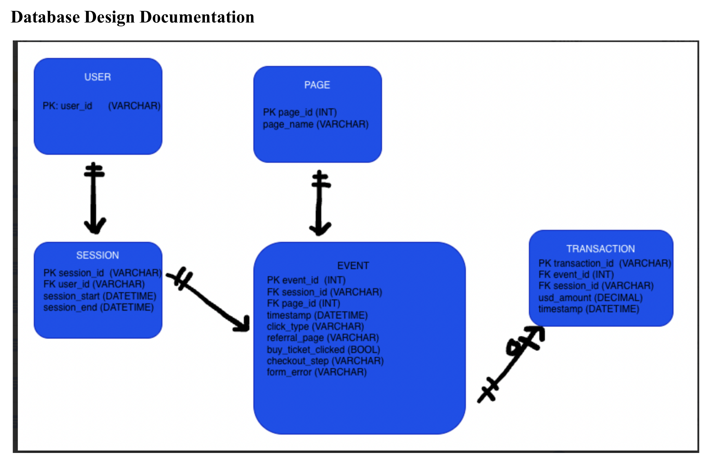
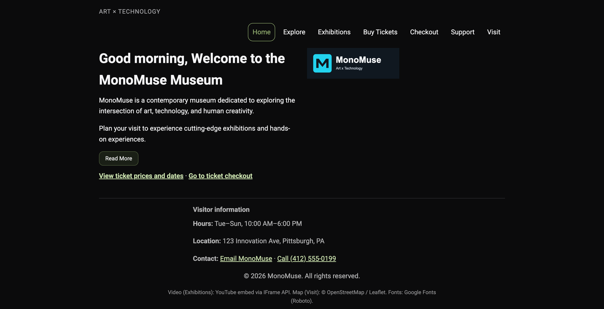
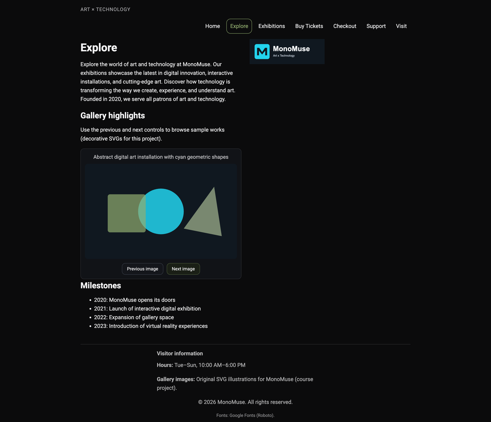
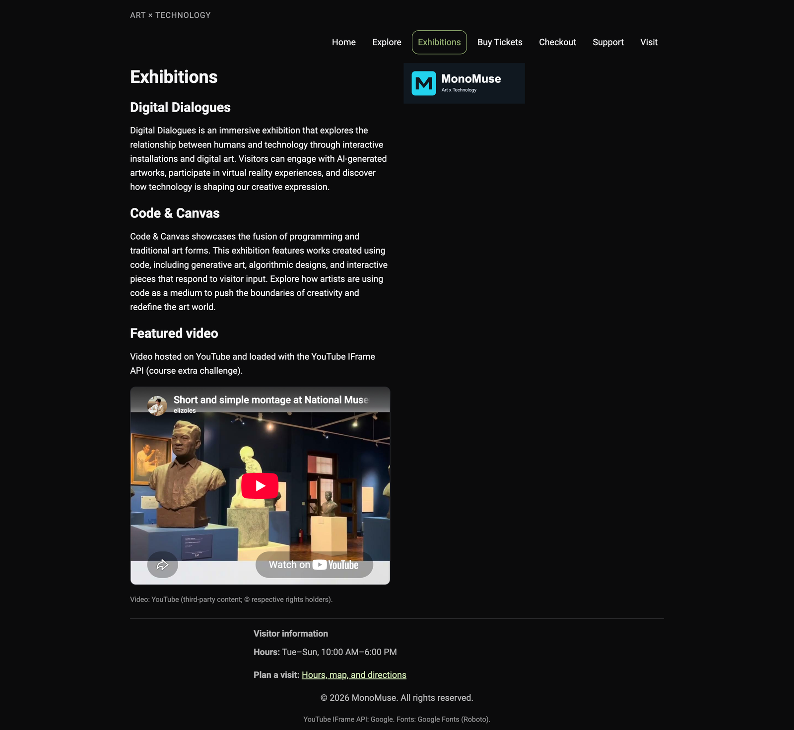
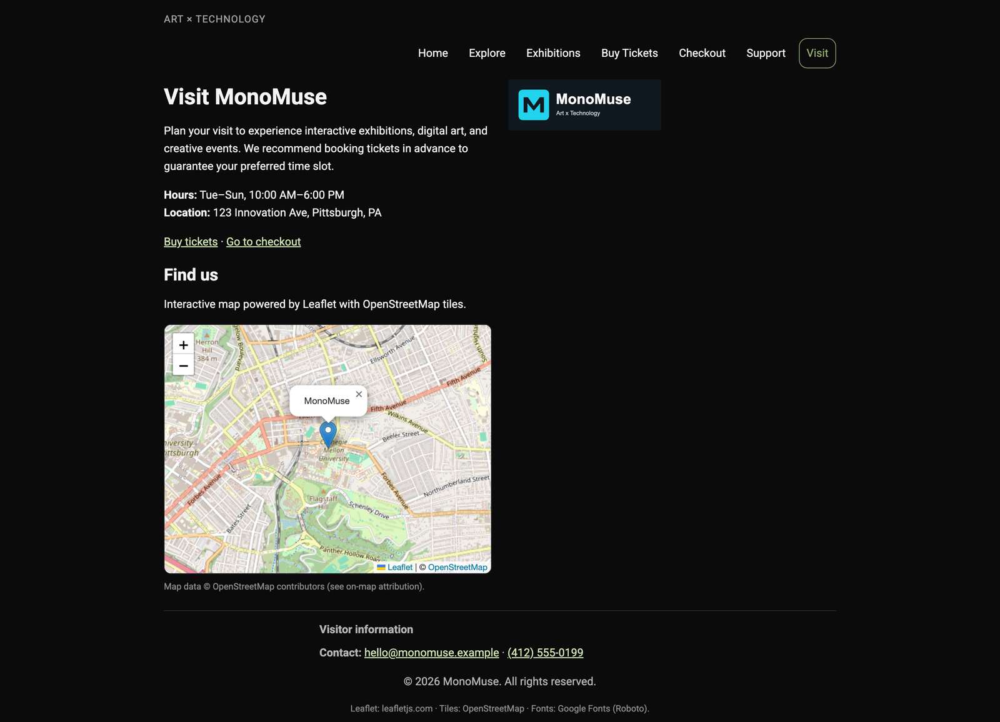
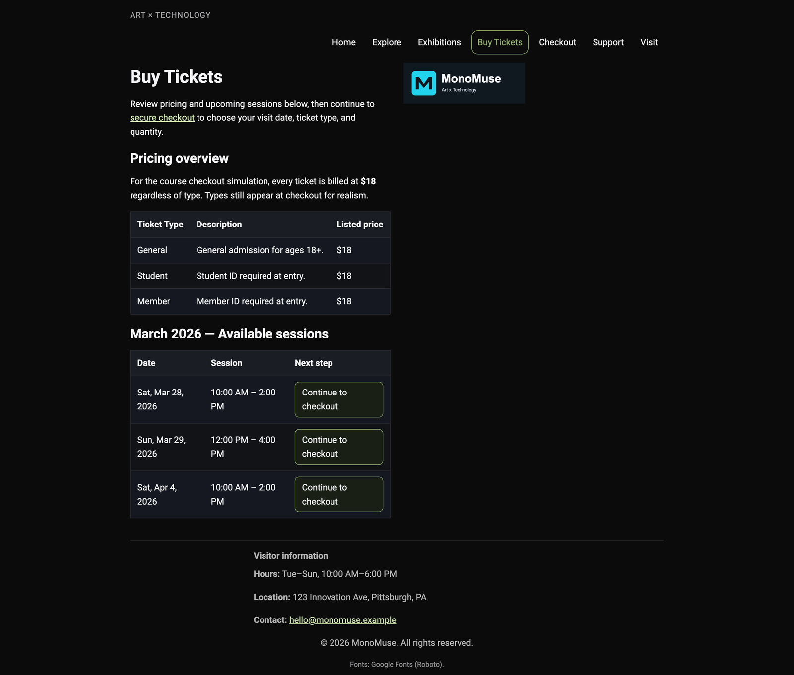
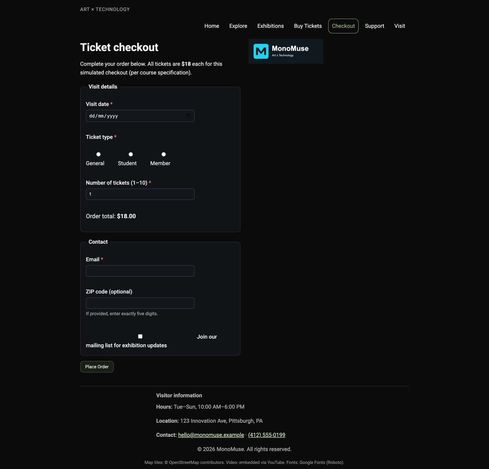
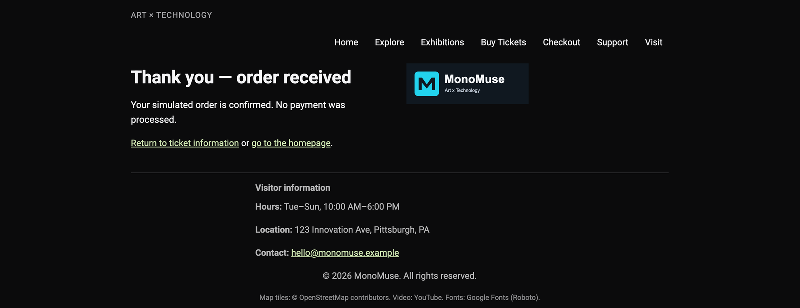

# MonoMuse — Data-Driven Museum Ticketing Redesign

A two-phase project where I used SQL analysis on 12,700+ interaction events to diagnose why a museum's ticket-purchase funnel was underperforming, then built a redesigned, responsive front end to fix the specific problems the data surfaced.

**[Full Phase A analysis report (PDF)](docs/phase-a-data-analysis-report.pdf)** — schema, data dictionary, every query, and written findings.

---

## The problem

MonoMuse's simulated visitor funnel was nearly **2x longer** than the industry benchmark (10.09 steps vs. a 5.1-step standard), and only **29.5%** of sessions ever reached a ticket page.

## Phase A — Diagnosing the funnel with SQL

Designed a relational schema (`USER`, `SESSION`, `PAGE`, `PAGEVISIT`, `TRANSACTION`) and wrote multi-table analytical queries over **1,259 sessions** and **12,707 page-visit events** to answer three questions.



| Question | Method | Finding |
|---|---|---|
| Is the funnel actually too long? | Segmented avg. step count across all / ticket-page / converted sessions | 10.09 avg steps vs. 5.1 benchmark — and converted users took *just as many* steps as everyone else, ruling out "users just leave" |
| Do checkout errors or user type explain the drop-off? | Joined `USER` + `SESSION` + `PAGEVISIT`, segmented by error flag and `user_type` | Guest (9.44%) and registered (9.49%) users converted almost identically — authentication wasn't the lever. All 61 form-error events were isolated to one page (`tickets_checkout`) |
| Which entry point converts best? | Identified each session's first page visit via `MIN(timestamp)`, joined to conversion outcome | **2.3x spread** between best (`exhibition_list`, 14.2%) and worst (`search_results`, 6.3%) entry pages — conversion was driven by *where users start*, not how long they browse |

**Conclusion:** the bottleneck was the absence of clear conversion paths on high-intent pages. That insight became the spec for Phase B.

<details>
<summary><strong>Query 1 — funnel length vs. industry benchmark</strong></summary>

```sql
SELECT
  COUNT(session_id) AS 'Total Sessions Analyzed',
  AVG(step_count) AS 'Avg Steps (All Sessions)',
  AVG(CASE WHEN reached_tickets = 1 THEN step_count END) AS 'Avg Steps (Ticket Sessions)',
  AVG(CASE WHEN converted = 1 THEN step_count END) AS 'Avg Steps (Converted Sessions)'
FROM (
  SELECT
    pv.session_id,
    COUNT(*) AS step_count,
    MAX(CASE WHEN p.name IN ('tickets_overview','tickets_checkout') THEN 1 ELSE 0 END) AS reached_tickets,
    MAX(CASE WHEN pv.checkout_step = 'complete' THEN 1 ELSE 0 END) AS converted
  FROM PAGEVISIT pv
  INNER JOIN PAGE p ON pv.page_id = p.page_id
  GROUP BY pv.session_id
) AS session_metrics
```

| Metric | Value |
|---|---|
| Avg steps — all sessions | 10.09 |
| Avg steps — ticket-page sessions | 10.17 |
| Avg steps — converted sessions | 10.07 |
| Industry benchmark (ConvertCart) | 5.1 steps |
| Funnel excess vs. benchmark | +97% longer |
| Sessions reaching ticket pages | 372 / 1,259 (29.5%) |
| Overall conversion rate | 119 / 1,259 = 9.45% |

</details>

<details>
<summary><strong>Query 2 — conversion rate by entry page</strong></summary>

```sql
SELECT
  entry_page.name AS 'Entry Page',
  COUNT(DISTINCT sm.session_id) AS 'Sessions Starting Here',
  SUM(sm.converted) AS 'Conversions',
  ROUND(SUM(sm.converted) / COUNT(DISTINCT sm.session_id) * 100, 2) AS 'Conversion Rate (%)',
  ROUND(AVG(sm.step_count), 2) AS 'Avg Steps'
FROM (
  SELECT pv.session_id, pv.page_id
  FROM PAGEVISIT pv
  INNER JOIN (
    SELECT session_id, MIN(timestamp) AS first_time
    FROM PAGEVISIT
    GROUP BY session_id
  ) AS first_ts
    ON pv.session_id = first_ts.session_id
    AND pv.timestamp = first_ts.first_time
) AS first_visit
INNER JOIN PAGE entry_page ON first_visit.page_id = entry_page.page_id
INNER JOIN (
  SELECT session_id, COUNT(*) AS step_count, MAX(CASE WHEN checkout_step = 'complete' THEN 1 ELSE 0 END) AS converted
  -- (subquery continues in the full report)
) AS sm ON sm.session_id = first_visit.session_id
GROUP BY entry_page.name
```

| Entry page | Sessions | Conversions | Conv. rate | Avg steps |
|---|---:|---:|---:|---:|
| `exhibition_list` | 113 | 16 | **14.16%** | 9.69 |
| `membership` | 119 | 15 | 12.61% | 9.91 |
| `map_directions` | 126 | 15 | 11.90% | 9.97 |
| `education` | 128 | 13 | 10.16% | 10.27 |
| `exhibition_detail` | 138 | 14 | 10.14% | 9.83 |
| `home` | 115 | 9 | 7.83% | 10.10 |
| `generic_content` | 131 | 10 | 7.63% | 10.02 |
| `visit_info` | 131 | 10 | 7.63% | 10.37 |
| `donate` | 132 | 9 | 6.82% | 10.45 |
| `search_results` | 126 | 8 | **6.35%** | 10.27 |

Step count barely moves across rows (9.7–10.5) while conversion swings 2.3x — the site's homepage converts *below* the dataset average, which is the finding that drove the Phase B redesign of the homepage and entry-heavy pages.

</details>

## Phase B — Rebuilding the front end around the data

Translated each finding into a concrete design decision:

- **Consistent global navigation + active-state indicators** across every page, so low-intent browsers always have a visible path to purchase (directly targets the "stable browsing depth, unstable conversion" finding)
- **Exhibitions and Visit pages rebuilt as conversion destinations** — embedded a YouTube IFrame API video on Exhibitions and an interactive Leaflet/OpenStreetMap on Visit, since those pages corresponded to the highest-converting entry patterns in the data
- **Linear ticket → checkout flow** (pricing → checkout with field-level validation → confirmation) replacing a fragmented ticket experience, addressing the checkout-error concentration found in Phase A
- **Responsive nav with mobile toggle**, semantic landmarks, descriptive alt text, and keyboard accessibility throughout
- Layout system: **CSS Grid** for page structure, **Flexbox** for component-level alignment, for a consistent design language across pages
- Documented design system (logo, color palette, type scale) plus external dependency citations (jQuery, Leaflet, YouTube API, Google Fonts)

### Screenshots

<table>
<tr>
<td width="50%"><a href="screenshots/home.png"></a><br><sub><b>Home</b> — restates the highest-value CTAs ("View ticket prices" / "Go to checkout") above the fold</sub></td>
<td width="50%"><a href="screenshots/explore.png"></a><br><sub><b>Explore</b> — gallery highlights and museum milestones</sub></td>
</tr>
<tr>
<td width="50%"><a href="screenshots/exhibitions.png"></a><br><sub><b>Exhibitions</b> — rebuilt as a conversion destination (highest-converting entry page in Phase A); embeds a YouTube IFrame API video</sub></td>
<td width="50%"><a href="screenshots/visit.png"></a><br><sub><b>Visit</b> — interactive Leaflet / OpenStreetMap embed</sub></td>
</tr>
<tr>
<td width="50%"><a href="screenshots/tickets.png"></a><br><sub><b>Buy Tickets</b> — pricing table and session picker feeding a single checkout path</sub></td>
<td width="50%"><a href="screenshots/checkout.png"></a><br><sub><b>Checkout</b> — field-level validation on the page Phase A flagged for 100% of form errors</sub></td>
</tr>
<tr>
<td width="50%"><a href="screenshots/confirmation.png"></a><br><sub><b>Confirmation</b> — closes the linear ticket → checkout → confirmation flow</sub></td>
<td width="50%"></td>
</tr>
</table>

## Why this project matters

This was data analysis used to scope a build instead of simply building a website. Every UI decision in Phase B traces back to a specific number from Phase A's queries. That loop (instrument → query → diagnose → ship → re-justify) is the same one I use in production work.

## Stack

SQL (MySQL/phpMyAdmin) for analysis · HTML/CSS/JS for the front end · Leaflet + OpenStreetMap · YouTube IFrame API

## Structure

```
/andrewid-increment1/   Phase B, earliest iteration of the site
/nandinit-increment2/   Phase B, styling + design system added
/nandinit-increment5/   Phase B, final site (screenshots above are from this version)
/docs/                  full Phase A data analysis report (PDF)
/screenshots/           README images
```

---

*Built for 67-250 (The Information Systems Milieux) at Carnegie Mellon University.*
